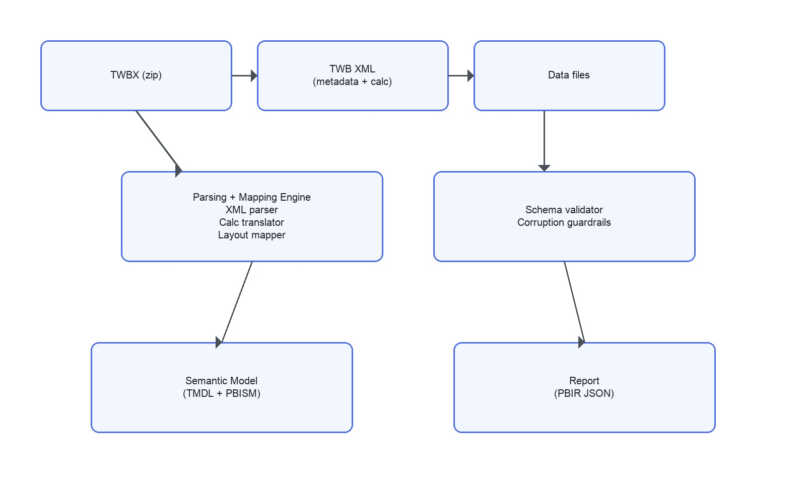
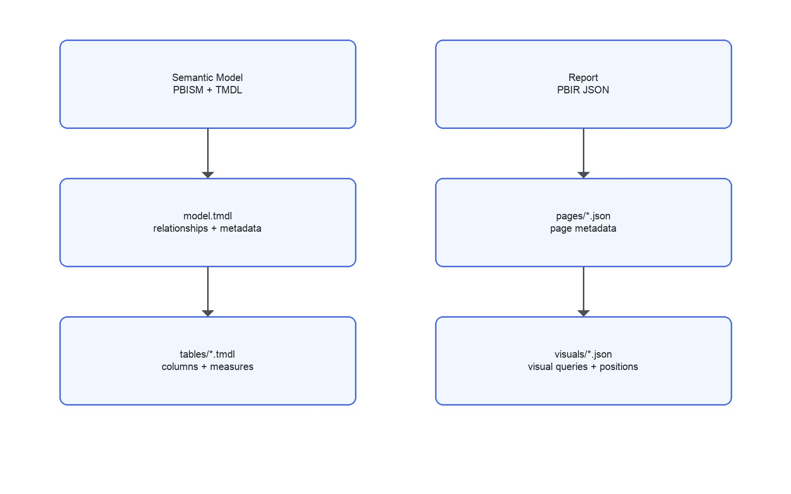
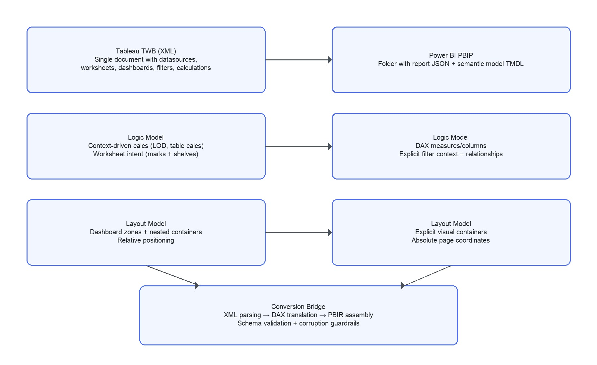

# TWBX to PBIP Conversion: Technical Explanation

## Executive Summary
This document explains the technical approach used to convert Tableau TWBX workbooks into Power BI PBIP projects with high fidelity. The conversion process reads the TWB XML inside a TWBX, reconstructs the semantic model (TMDL), and generates report visuals (PBIR JSON) that match Tableau dashboards pixel‑for‑pixel where possible. It is designed to be robust, schema‑compliant, and safe from PBIP corruption.

## What the Approach Produces
- A PBIP folder with a Power BI report and semantic model.
- All table relationships, measures, and calculated fields mapped from Tableau.
- Visuals recreated from Tableau dashboards, aligned to snapshot imagery.
- A repeatable process that enforces schema rules to prevent breakage.

## High‑Level Architecture
```
Inputs
  ├─ Tableau TWBX
  │   ├─ TWB XML (metadata + calculations + layout)
  │   └─ Packaged data (extractable files)
  ├─ Empty PBIP template
  └─ Tableau snapshot images
              │
              ▼
Parsing + Mapping Engine
  ├─ XML parser (datasources, worksheets, dashboards)
  ├─ Calculation translator (Tableau → DAX)
  ├─ Relationship builder
  ├─ Visual mapper + layout engine
  └─ Schema validator + corruption guardrails
              │
              ▼
Outputs
  ├─ PBIP item shortcut (.pbip)
  ├─ Report definition (PBIR JSON)
  └─ Semantic model (TMDL)
```

## Architecture Diagrams (JPEG)
- `docs/diagrams/twbx_to_pbip_architecture.jpg`
- `docs/diagrams/pbip_assembly_architecture.jpg`
- `docs/diagrams/twb_vs_pbip_schema_logic.jpg`




## Detailed Data Flow
```
TWBX
  └─ unzip → TWB XML
          ├─ Datasources + tables → TMDL tables
          ├─ Joins/relationships → model.tmdl
          ├─ Calculations → DAX measures/columns
          ├─ Worksheets → visual mappings
          ├─ Dashboards → report pages
          └─ Filters/parameters → slicers/interactions
Snapshots
  └─ layout + style references → visual positions + formatting
```

## Architecture Diagram: TWB XML to DAX + PBIP
```
TWBX (zip)
  ├─ workbook.twb (XML)
  │    ├─ datasources → tables + columns → TMDL tables/*.tmdl
  │    ├─ relations/join graph → model.tmdl relationships
  │    ├─ calculations → DAX measures/columns
  │    ├─ worksheets → visual spec + fields + mark type
  │    ├─ dashboards → PBIR pages + layout coordinates
  │    └─ filters/parameters → PBIR filters + slicers + interactions
  └─ Data/* (extractable files)
            └─ Power Query source mapping (File.Contents)

Snapshots (images)
  └─ layout + style → pixel alignment + formatting
```

## Architecture Diagram: PBIP Assembly
```
Semantic Model (PBISM + TMDL)
  ├─ definition.pbism (version + settings)
  ├─ database.tmdl (compatibilityLevel)
  ├─ model.tmdl (relationships + metadata + annotations)
  └─ tables/*.tmdl (columns + measures + partitions)
                 │
                 ▼
Report (PBIR JSON)
  ├─ definition.pbir (datasetReference)
  ├─ report.json (theme + settings)
  ├─ pages/pages.json (order + active)
  └─ pages/<pageId>/
       ├─ page.json (size + displayName)
       └─ visuals/<visualId>/visual.json (queries + positions)
```

## Core Components
### 1) TWB XML Parser
Extracts all metadata needed to reproduce the model and report:
- Datasources and table schemas
- Columns with data types
- Worksheet definitions and mark types
- Dashboard layout and zones
- Filters, parameters, and global settings

### 2) Calculation Translator (Tableau → DAX)
- Generates exact DAX for calculations when an equivalent exists.
- If the Tableau expression is non‑portable, the translator applies a closest‑match rule and records it in an assumptions log.
- Supports:
  - Aggregations and row‑level calcs
  - FIXED/INCLUDE/EXCLUDE patterns when mappable
  - Parameter‑driven logic
  - KPI switching via calculation groups

### 3) Semantic Model Builder (TMDL)
Produces:
- `tables/*.tmdl` for each datasource or logical table
- `model.tmdl` relationships and metadata
- `database.tmdl` compatibility settings

### 4) Report Generator (PBIR JSON)
Produces:
- Pages for each Tableau dashboard
- Visuals for each worksheet
- KPI cards with complete `visual.json` definitions
- Page order and active page metadata

### 5) Validation + Corruption Guardrails
Strict schema rules prevent invalid PBIP output:
- All JSON files adhere to official schemas and versions
- All IDs are unique and referenced correctly
- All visuals have valid positions and queries
- Paths are relative and OS‑agnostic

## Conversion Deep Dive
### A) TWB XML Extraction and Normalization
- Unzip TWBX and extract the single `workbook.twb` XML.
- Normalize namespaces, resolve embedded datasource references, and build a consistent map of:
  - Datasources and connections
  - Logical/physical table names
  - Columns + data types + captions
  - Calculations and dependencies
  - Worksheet definitions (rows, columns, marks, filters)
  - Dashboard zones (layout containers + coordinates)

### B) Semantic Model Reconstruction (TMDL)
- Create one `.tmdl` per logical table with:
  - `column` definitions (type + summarizeBy)
  - `measure` definitions (DAX)
  - `partition` definitions (Power Query M; `File.Contents` or datasource as needed)
- Build `model.tmdl`:
  - Explicit relationships with cardinality and direction
  - Metadata annotations for Power BI tooling

### C) Calculation Translation (Tableau → DAX)
- Translate Tableau expressions to DAX using a ruleset:
  - Aggregations → DAX equivalents (SUM, AVG, COUNTX)
  - Conditional logic → IF / SWITCH
  - Date logic → DATE, EOMONTH, DATEADD
  - LOD expressions → CALCULATE patterns
- Validate translated DAX against column lineage to ensure semantic correctness.
- Log any non‑portable expressions in “Assumptions.”

### D) KPI Switching via Calculation Group
- Generate a calculation group that switches between KPI measures.
- Bind KPI card visuals to the calculation group so a single card can display multiple KPIs.
- Use a parameter/slicer to control the active KPI selection.

### E) Report Assembly (PBIR JSON)
- Pages:
  - One page per Tableau dashboard.
  - Exact `width`, `height`, and `displayOption`.
- Visuals:
  - One visual per worksheet (or worksheet component).
  - Full `visual.json` with `visualType`, `query`, and `position`.
  - Query projections reference existing model fields only.
- Filters and Interactions:
  - Map Tableau filter zones to Power BI slicers.
  - Recreate cross‑filtering behavior across visuals.

### F) Pixel‑Matched Layout
- Use snapshot images to validate spacing, alignment, and visual proportions.
- Ensure exact `x`, `y`, `width`, `height` coordinates for each visual.
- Apply theme and formatting to match typography, colors, and legends.

### G) Integrity Checks
- Schema validation for each JSON/TMDL file.
- Cross‑reference validation:
  - Every visual query references valid fields.
  - Every page/visual referenced in `pages.json` exists.
- Open PBIP in Power BI Desktop to confirm no corruption.

## Schema Differences: Tableau TWB vs Power BI PBIP
### Tableau TWB (XML) logic
- A single XML document that encodes datasources, relationships, worksheets, dashboards, filters, and calculations.
- Calculations are stored as Tableau expressions with context‑dependent evaluation (LOD, table calcs, parameters).
- Worksheets describe visual intent (mark type, rows/cols shelves) rather than a fully materialized rendering definition.
- Dashboards define layout through zones and nested containers.

### Power BI PBIP logic
- PBIP is a folder structure with separate schemas:
  - **Semantic model** in TMDL (`*.tmdl`) with explicit columns, measures, relationships, and partitions.
  - **Report** in PBIR JSON with explicit visuals, positions, and queries.
- DAX is required for all calculations and is evaluated in a different filter context model than Tableau.
- Visuals are fully described with query projections and container metadata.

### Key Differences in Logic
- **Context evaluation:** Tableau’s LOD/table calcs are context‑driven; Power BI uses filter context and DAX semantics.
- **Visual definition:** Tableau worksheets define intent; PBIR requires explicit visual JSON with queries and positions.
- **Relationships:** Tableau can use logical/physical layers; Power BI requires explicit relationships in model.tmdl.
- **Parameters and filters:** Tableau parameters are global by default; Power BI often uses slicers or calculation groups.

### How the Conversion Bridges the Gap
- Tableau calculations are translated to DAX with explicit context handling.
- Worksheet intent is translated to concrete visual JSON (visualType + query + position).
- Dashboard zones are mapped to page coordinates, ensuring pixel alignment.
- Relationships are generated explicitly in model.tmdl to match logical data model behavior.

## Schema Examples: TWB vs PBIP
### Tableau TWB (XML) excerpt
```
<datasource name="ds1" caption="Orders">
  <column name="[Sales]" datatype="real" role="measure" />
  <calculation name="[Profit Ratio]" formula="[Profit] / [Sales]" />
</datasource>
<worksheet name="Overview">
  <table>
    <rows>[Sales]</rows>
    <cols>[Order Date]</cols>
    <panes>
      <pane>
        <mark class="bar" />
      </pane>
    </panes>
  </table>
</worksheet>
```

### Power BI PBIP (TMDL + PBIR) excerpts
**TMDL table (`tables/Orders.tmdl`):**
```
table 'Orders'
  column 'Sales'
    dataType: double
    summarizeBy: sum
    sourceColumn: Sales
  measure 'Profit Ratio' = DIVIDE(SUM('Orders'[Profit]), SUM('Orders'[Sales]))
    formatString: "0.0%"
```

**PBIR visual (`visuals/<visualId>/visual.json`):**
```
{
  "$schema": "https://developer.microsoft.com/json-schemas/fabric/item/report/definition/visualContainer/2.5.0/schema.json",
  "name": "sales_by_date",
  "position": { "x": 40, "y": 80, "width": 520, "height": 320, "z": 0 },
  "visual": {
    "visualType": "columnChart",
    "query": {
      "queryState": {
        "Values": { "projections": [ { "field": { "Measure": { "Expression": { "SourceRef": { "Entity": "Orders" } }, "Property": "Total Sales" } } } ] },
        "Category": { "projections": [ { "field": { "Column": { "Expression": { "SourceRef": { "Entity": "Orders" } }, "Property": "Order Date" } } } ] }
      }
    }
  }
}
```

## Folder Output (PBIP)
```
<Project>.pbip
<Project>.Report/
  definition.pbir
  definition/
    report.json
    version.json
    pages/pages.json
    pages/<pageId>/page.json
    pages/<pageId>/visuals/<visualId>/visual.json
  StaticResources/SharedResources/BaseThemes/<theme>.json (optional)
<Project>.SemanticModel/
  definition.pbism
  definition/
    database.tmdl
    model.tmdl
    cultures/en-US.tmdl
    tables/*.tmdl
  diagramLayout.json (optional)
```

## Accuracy Strategy
Accuracy is achieved through layered validation and direct metadata use:
1. **Direct XML extraction** ensures no loss of information from the TWBX.
2. **Exact DAX translation** targets functional parity with Tableau logic.
3. **Schema‑first output** reduces risk of Power BI load failure.
4. **Snapshot‑aligned layout** ensures pixel‑level visual similarity.

### Accuracy Considerations
- **Best case:** 1:1 mapping with identical numbers, visual layout, and interactions.
- **Edge cases:** Certain Tableau features can be approximated but may require assumptions:
  - Complex LOD expressions
  - Custom marks or proprietary Tableau features
  - Nested table calcs with context dependency

These exceptions are explicitly logged and surfaced in an “Assumptions” section in the final output.

## KPI Switching via Calculation Groups
KPI switching is implemented via a calculation group that dynamically changes the selected measure for a KPI visual. This enables a single card or chart to swap between metrics based on a slicer/parameter. Each KPI card visual is fully defined in its own `visual.json`.

## Why This Does Not Break PBIP
- Schema versions and URLs are fixed and validated.
- Each JSON file strictly matches its official definition.
- No additional files or properties are injected.
- Names, IDs, and references are consistent across report metadata.

## Leadership Summary
This approach provides:
- **Speed:** Automated conversion from Tableau to Power BI.
- **Precision:** Model and visuals closely replicate the source.
- **Reliability:** Schema‑safe PBIP output that opens cleanly in Desktop.
- **Traceability:** Clear assumptions logged for any non‑portable features.

The result is an enterprise‑grade conversion pipeline that preserves business logic and visual fidelity while minimizing the risk of PBIP corruption or report failure.
